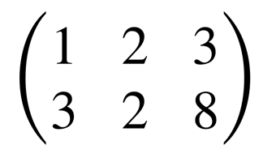

# Mathdown
A lightweight syntax for matrices.
Outputs [MathML](https://en.wikipedia.org/wiki/MathML) format.

## Syntax
```
[
1 2 3
3 2 8
]
```


You can also use [Markdown](https://en.wikipedia.org/wiki/Markdown)-style text emphasis
- `_<text>_` or `*<text>*` for _italic_
- `__<text>__` or `**<text>**` for __bold__
- `___<text>___` or `***<text>***` for ___italic and bold___

```
[
***1*** 2 __3__
   3   _2_  8
]
```


You can use `_` to leave an empty space in the matrix

```
[
***1*** 2 __3__ | _
   _   _2_  8   | 4
]
```


Newlines separate `elements` of your expressions.
`//` denotes the start of a normal comment. It is not present in the output.

```
[
***1*** 2 __3__ | _ // This is a normal comment
_      _2_  8   | 4
]

1⊕=0
->
a=2b

// This is also a normal comment

[
1 2
5 3
]
```


`#` is used to make a `separator` comment. It separates your expressions into dedfferent `<math>` elements and is converted to an `xml` comment in the output document.

## Usage
`mathdown -b:r -i input.mth -o output.xml`

### Parameters
- `-i <file path>` Specifies the input path
- `-o <file path>` Specifies the output pathfile
- `-b:s` Uses square brackets
- `-b:r` Uses round brackets
- `-b:l` Uses line brackets
